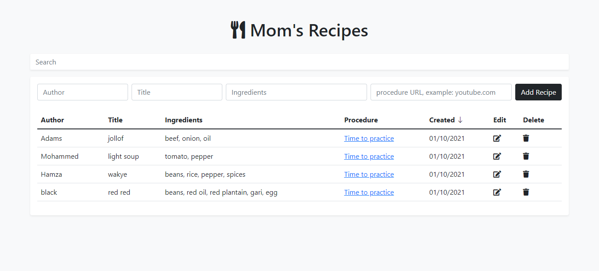

# Recipe App with Firebase and Webpack

A simple recipe app for keeping track of your mother's favourite dishes. You can also include a list of the food's ingredients, a link to a blog or vlog that shows how it's created, and other information.

## Motivation

I started this endeavour because I adore my mother's cooking and believe she is the best cook on the planet. So I started this PROJECT to share her recipes with the world.

## Screenshot

[]()

## URL

[Recipe App with Firebase and Webpack](https://fervent-poincare-753525.netlify.app)

## Installation

1. Clone Repo
2. cd to the directory where cloned folder is locacted
3. run: npm install in your shell

```bash
npm install
```

## Tech/framework used

1. HTML5
2. CSS3
3. Bootstrap 5
4. JavaScript
5. Firebase
6. Webpack

## Contributing

Pull requests are welcome. For major changes, please open an issue first to discuss what you would like to change.

## License

[MIT](https://choosealicense.com/licenses/mit/)
